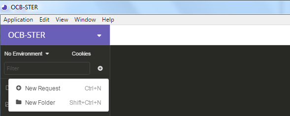
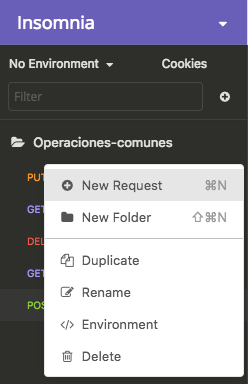
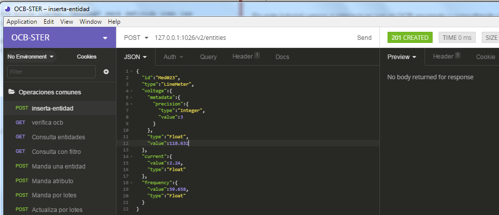
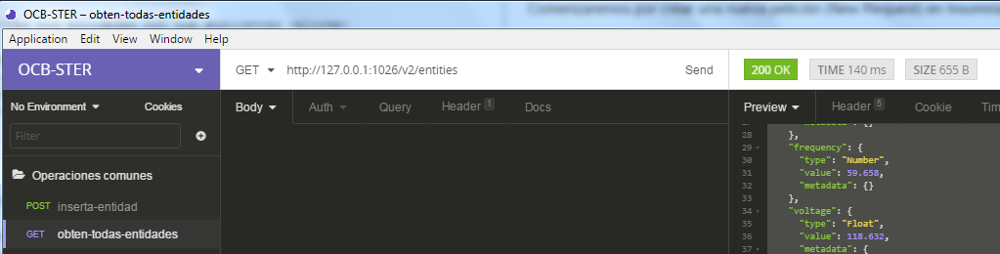
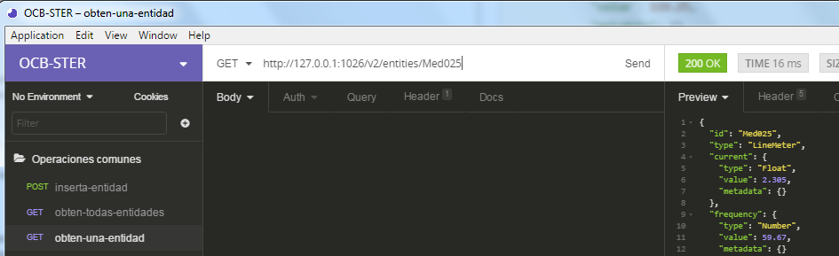
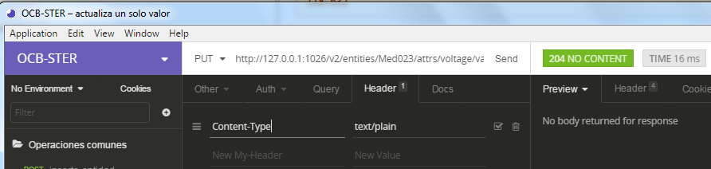
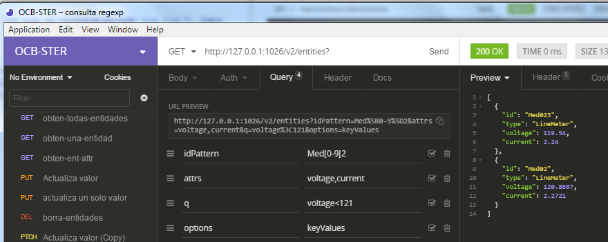
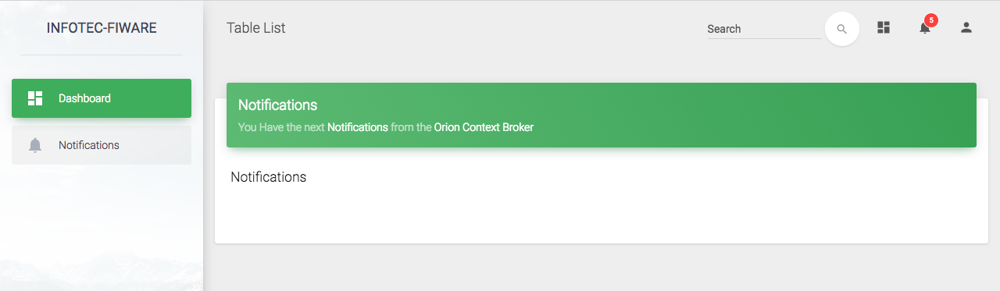
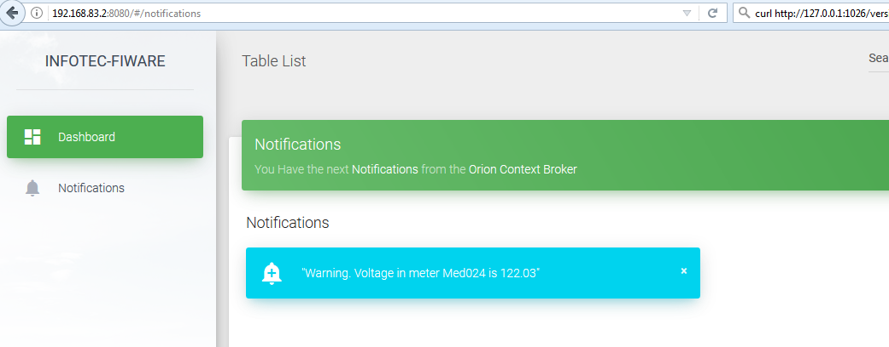

# Tutorial Fiware - Orion Context Broker

##Introducción

El objetivo de este tutorial es dar una idea básica del flujo de datos típico al implementar aplicaciones inteligentes que utilicen información obtenida de diferentes medios como sensores, usuarios de dispositivos móviles, etcétera. 


En Fiware, para que las aplicaciones puedan obtener esa información, un componente esencial es el Orion Context Broker (OCB). Orion Context Broker es una implementación de la API NGSI (*Next Generation Service Interface*) que permite manejar y asegurar la disponibilidad de la información obtenida del contexto donde se encuentra el objeto (el sensor). La versión que se utiliza actualmente es **NGSIv2**.

La especificación completa de NGSIv2 se encuentra aquí: [http://fiware.github.io/context.Orion/api/v2/stable/](http://fiware.github.io/context.Orion/api/v2/stable/).


La interacción típica en la plataforma Fiware (como en la mayoría de las plataformas para Internet de las Cosas) consta de tres elementos: el productor de información de contexto (por ejemplo, un sensor), un intermediario, que en nuestro caso es el OCB, y el consumidor de esa información.


El productor de información de contexto se encargará de crear nuevas entidades o de actualizar las entidades ya existentes. Típicamente accede al OCB a través del **puerto 1026**.

Los últimos datos se mantienen persistentes en el OCB con ayuda de una base de datos; en nuestro caso, se utilizará MongoDB.

El OCB funciona como intermediario entre los productores de información y otros componentes (los consumidores de información) como pueden ser un tablero de mando para representar gráficamente la información, un conector hacia bases de datos o repositorios de big data, un procesador en tiempo real, etcétera.

En este tutorial vamos a interactuar con el OCB enviando y consultando representaciones de objetos a través de una API REST.

## Representación de datos de contexto

Para representar objetos de la vida real se utiliza el modelo de entidades de la API NGSI. En éste se define un **modelo de datos** de información de contexto basado en *entidades* y en *atributos*. Cada entidad representa un objeto de la vida real y puede tener atributos y metadatos.

Las entidades cuentan con un identificador (ID) y un tipo. **Esta pareja ID/tipo debe ser única en el OCB**.  Los atributos y metadatos se representan por una tupla **[nombre, tipo, valor]**. 

Todos los datos estarán representados con el formato JSON (también podrían representarse en otro formato, por ejemplo, key/value). El formato de datos **JSON (Java Script Object Notation)** es ligero para el intercambio de información, además de ser fácil de leer, así como de procesar.

Un Objeto JSON tienen las siguiente forma:


Es decir, se encuentran definidos entre llaves. *String* será definido como las propiedades entidades. Los *value* son los atributos.

Por ejemplo, si se desea representar las lecturas de un medidor eléctrico en la red de bajo voltaje, la entidad podría representarse de esta manera:

```bash
{
	"id":"Med023",
	"type":"LineMeter",
	"voltage":{
		"metadata":{
			"precision":{
				"type":"Integer",
				"value":3
			}
		},
		"type":"Float",
		"value":118.632
	},
	"current":{
		"value":2.24,
		"type":"Float"
	},
	"frequency":{
		"value":59.658
	}
}
```

Como se observa en el ejemplo anterior, en los atributos se puede especificar o no el tipo de dato. Se recomienda especificarlo siempre; si se omite, el OCB tratará de inferirlo.  

También se observa que la metadata es opcional y en caso de exisitir, su formato será también una tupla [nombre, tipo, valor].

*Nota:* Fiware ya tiene un conjunto de modelos estandarizados. Pueden consultarse en la página [https://www.fiware.org/data-models/](https://www.fiware.org/data-models/). Otra página de interés es [http://schema.org/](http://schema.org/). Si se encuentra un modelo del objeto que deseamos representar, conviene utilizar esos esquemas para que nuestro producto sea interoperable.

### Interactuando con el OCB
Si no lo ha hecho, lance la máquina virtual y el contenedor donde se encuentra el Orion Context Broker.  En nuestra guía de instalación, los comandos correspondientes son:
```bash
$ cd /c/fwTutorial/Fiware/vm-fiware-orion
# Lance vagrant
$ vagrant up
Bringing machine 'default' up with 'virtualbox' provider...
...
# Entre la la VM
$ vagrant ssh
fiware-sdk:~
$ docker-compose up -d
fiware-sdk:~
```

El OCB contiene una interfaz tipo Web para realizar las consultas a la base de datos MongoDB. Se trata de un servicio web de tipo REST (Representational state transfer). 

En este tutorial, la interacción con el OCB se hará a través de solicitudes HTTP con un cliente REST. Para ello, se debe especificar el URL al cual estaremos haciendo la solicitud, el método REST de la solicutud, el encabezado y el cuerpo de la solicitud.

Este tipo de servicios permiten obtener información de forma arborecente. Es decir, es posible obtener | actualizar | borrar información de una entidad completa o sólo valores de una entidad en específico.

El URL al que haremos la solicitud sera: **http://localhost:1026/v2/...**, es decir, a través del puerto 1026 y utilizando la versión 2 de la NGSI.

Para poder interactuar con el OCB utilizaremos la herramienta *Insomnia*. Si lo desea, puede utilizar cualquier otro cliente REST.  De hecho, se puede hacer desde la terminal de git con el comando `curl`, pero ello es mucho más propenso a errores.

Crearemos en insomnia una carpeta llamada **Operaciones-Comunes**. En esta carpeta se guardarán todas las consultas que hagamos.



#### POST
En primer lugar debemos enviar la representación de una entidad con el método **POST**:
Comenzaremos por crear una nueva petición (New Request) en Insomnia:



El nombre sugerido para esta petición es **inserta-entidad**, el método que utilizaremos será **POST** y el cuerpo (body) será de tipo JSON.

El URL que utilizaremos será **http://localhost:1026/v2/entities** y el tipo de encabezado será *application/json*. En Insomnia se establece automaticamente cuando seleccionamos JSON como el tipo de dato (en algunas operaciones posteriores, utilizaremos un body tipo *text/plain*).

En el cuerpo de la consulta, en la parte media de Insomnia, colocaremos la descripción de la entidad Med023.

  

Si todo está correcto, al dar `Send` en el extremo derecho de Insomnia se debe observar el mensaje `201 CREATED` y el cuerpo de la respuesta debe estar vacío.

___
**EJERCICIO**.  Agregue otras dos entidades con los siguientes valores:

id|voltaje|current|frequency
--|-------|-------|---------
Med024|119.25|2.062|60.256
Med025|121.046|2.305|59.67
___


#### GET
Para obtener información de la base de datos en el OCB se utiliza el método **GET**. 

En Insomnia, es posible duplicar la consulta anterior y renombrarla. Hágalo así y nombre la nueva consulta `obten-todas-entidades`. Por supuesto, debe modificar el método de POST a GET.

Para el método get,  sólo se especifica el URL, sin body ni Content-type. En nuestra primer consulta pediremos todas las entidades almacenadas en el OCB hasta ahora.  Para ello, el URL que se utiliza es: `http://localhost:1026/v2/entities`: 



Al ejecutarlo se obtiene el siguiente resultado:

```javascript
[
	{
		"id": "Med024",
		"type": "LineMeter",
		"current": {
			"type": "Float",
			"value": 2.062,
			"metadata": {}
		},
		"frequency": {
			"type": "Float",
			"value": 60.256,
			"metadata": {}
		},
		"voltage": {
			"type": "Float",
			"value": 119.25,
			"metadata": {}
		}
	},
	{
		"id": "Med023",
		"type": "LineMeter",
		"current": {
			"type": "Float",
			"value": 2.24,
			"metadata": {}
		},
		"frequency": {
			"type": "Number",
			"value": 59.658,
			"metadata": {}
		},
		"voltage": {
			"type": "Float",
			"value": 118.632,
			"metadata": {
				"precision": {
					"type": "Integer",
					"value": 3
				}
			}
		}
	},
	{
		"id": "Med025",
		"type": "LineMeter",
		"current": {
			"type": "Float",
			"value": 2.305,
			"metadata": {}
		},
		"frequency": {
			"type": "Number",
			"value": 59.67,
			"metadata": {}
		},
		"voltage": {
			"type": "Float",
			"value": 121.046,
			"metadata": {}
		}
	}
]
```

**Nota**: Si se está consultando un OCB en la nube, se requiere un token de acceso que le es asignado por un gestor de identidades.  En estos casos, el token se agrega en el `X-Auth-Token`.

##### Consulta acotada.

Podemos consultar una sola entidad agregando el identificador de esa entidad al final del URL.

___
**EJERCICIO**.  Agregue una nueva consulta a Insomnia. Nómbrela obten-una-entidad y modifíquela para obtener únicamente la entidad Med025
___



De forma similar, a partir de la versión 2 de NGSI es posible realizar consultas (u otros métodos como PUT y DELETE) a atributos de las entidades ampliando el URL:

```javascript
GET URL/v2/entities/{entityID}/attrs/{attrName}
```

Por ejemplo, para ver el atributo "current" de la entidad Med023, se utiliza el URL `http://127.0.0.1:1026/v2/entities/Med023/attrs/current/`, y si se desea únicamente su valor, se extiende el URL hasta: `http://127.0.0.1:1026/v2/entities/Med025/attrs/current/value/`.

___
**EJERCICIO**. Agruegue una nueva consulta en Insomnia. Nómbrela consulta-por-atributos y modifíquela para consultar
- El atributo frequency de la entidad Med024
- El valor del voltage de la entidad Med023

Los resultados obtenidos deben ser los siguientes:
```javascript
{
	"type": "Float",
	"value": 60.256,
	"metadata": {}
}

y

118.632
```
___

### Actualización de valores

Si deseamos actualizar los valores de los atributos de una entidad que ya se encuentra en el OCB, se utiliza el método **PUT**.  Cuando se actualizan los valores de varios atributos a la vez, se utiliza el URL hasta el identificador de la entidad y en el cuerpo se especifican los nuevos valores en formato JSON.

En el siguiente ejemplo, se modificarán únicamente los valores de los atributos *frequency* y *current* de la entidad *Med024*:

```bash
Método: PUT
URL: http://127.0.0.1:1026/v2/entities/Med024/attrs

Body:
{
	"frequency": {
		"value": 62.23,
        "type":"Float"
	},
	"current":{
		"value":1.97,
        "type":"Float"
	},
    "voltage":{
    	"type":"Float",
        "value":122.03
    }
}

Header: Content-type:  application/json
```
Con este método, si se omite un attributo, éste desaparece de la entidad. Si lo que se desea es actualizar únicamente alguno o algunos de los atributos, el método que debe usarse es **PATCH**.  Por ejemplo, si sólo se desea actualizar current y frequency de la entidad Med025, la consulta se hará así:

```bash
Método: PATCH
URL: http://127.0.0.1:1026/v2/entities/Med025/attrs

Body:
{
	"current":{
		"value":2.23,
        "type":"Float"
	},
    "frequency":{
    	"type":"Float",
        "value":61.32
    }
}

Header: Content-type:  application/json
```

Frecuentemente, lo que se desea es actualizar únicamente el valor de un atributo. En este caso, como se hizo anteriormente, se extiende el URL hasta {attrId}/value y en el cuerpo del mensaje se coloca el valor, especificando que el tipo de contenido es texto plano.

Por ejemplo, para actualizar el valor del atributo voltage en la entidad Med023 se haría lo siguiente:

```bash
URL: http://127.0.0.1:1026/v2/entities/Med023/attrs/voltage/value

Body:
119.54

Content-type text/plain
```

En Insomnia, en la pestaña del cuerpo se especifica "Other" y en la de Header se especifica `Content-type  text/plain`.




Es posible borrar atributos e identidades.

Para borrar un atributo se utiliza el comando Delete:

    delete http://url:1026/v2/entities/{id}/attrs/{value}
Para borrar una se utiliza la siguiente expresión:

    delete http://url:1026/v2/entities/{id}
    
### Delete
El método DELETE permite eliminar entidades y atributos.
Para probar este método, creemos una nueva entidad:

```bash
{
  "id":"ineel",
  "type":"prueba",
  "temp":{
    "value":24,
    "type":"integer",
  },
  "NumGente":{
    "type":"integer",
    "value":607
  }
}
```

___
**Ejercicio**  
Verifique que la entidad fue creada (utilice la consulta obten-todas-entidades).

Elimine la variable NumGente utilizando el comando DELETE en esta URL `http://127.0.0.1:1026/v2/entities/ineel/attrs/NumGente`.

Verifique que la variable fue eliminada.

Ahora elimine la entidad completa con la URL `http://127.0.0.1:1026/v2/entities/ineel`.
___

### Operaciones por lotes

NGSIv2 tiene la función `Update` que permite crear, actualizar o borrar varias entidades en una sola invocación de un método POST.  Por supuesto, en el cuerpo del método se especifica la representación de las entidades y sus atributos. 

Hasta ahora hemos utilizado el formato JSON; en el siguiente ejemplo representaremos las entidades y atributos como tuplas key-value, lo cual se señalará con una opción en el URL.

La representación es más corta y fácil de leer, pero se pierde riqueza semántica. Por ejemplo, ya no se puede especificar el tipo de datos de los atributos; NGSI los considerará "Numeric".

Cree una nueva consulta (nómbrela Agrega por lotes) con las siguientes características (**Observe el formato especial del URL**):

```bash
Método: POST
URL: http://127.0.0.1:1026/v2/op/update?options=keyValues

Body:
{
	"actionType":"APPEND",
	"entities": [
		{
			"id": "Med01",
      "type": "LineMeter",
      "voltage":119.1956,
      "current":1.9081,
      "frequency":59.7123
     },
	 {
      "id": "Med02",
      "type": "LineMeter",
      "voltage":120.8887,
      "current":2.2721,
      "frequency":60.0207
     },
	 {
      "id": "Med03",
      "type": "LineMeter",
      "voltage":120.7730,
      "current":2.0711,
      "frequency":60.0589
     },
	 {
      "id": "Med04",
      "type": "LineMeter",
      "voltage":120.3477,
      "current":2.1015,
      "frequency":59.9456
	 },
	 {
      "id": "Med05",
      "type": "LineMeter",
      "voltage":119.9467,
      "current":2.1935,
      "frequency":59.6615
     },
	 {
			"id": "Med06",
      "type": "LineMeter",
      "voltage":118.8686,
      "current":1.9050,
      "frequency":59.9421
     },
	 {
      "id": "Med07",
      "type": "LineMeter",
      "voltage":120.0224,
      "current":2.0522,
      "frequency":59.9396
     },
	 {
      "id": "Med08",
      "type": "LineMeter",
      "voltage":118.8943,
      "current":2.1845,
      "frequency":59.7099
     },
	 {
      "id": "Med09",
      "type": "LineMeter",
      "voltage":120.4780,
      "current":2.0130,
      "frequency":60.3876
	 },
	 {
      "id": "Med10",
      "type": "LineMeter",
      "voltage":120.228,
      "current":2.225,
      "frequency":59.8962
     }
	]
}


Header: Content-type:  application/json
```

**Verifique que las entidades se cargaron en el OCB**.

## OCB Simple Query Language
NGSI ofrece una sintaxis simplificada para filtrar información con base en algún criterio. Se pueden agregar condiciones de filtrado con el operador "&".  Los resultados que se devuelven son las entidades que cumplan con TODOS los criterios.

**Todas las consultas se hacen con el método GET**

Al realizar una consulta, el OCB entrega por default 20 entradas.  Si se desea traer más o menos, se puede agregar el parámetro `limit` al query.  También se puede especificar el parámetro `offset` para indicar a partir de qué entidad se obtendrán los resultados.

Por ejemplo, la siguiente consulta mostrará tres entidades de tipo "LineMeter" (por ahora todas nuestras entidades son de ese tipo) a partir del 5o registro y éstas se mostrarán en formato key-value:

```bash
GET http://127.0.0.1:1026/v2/entities?limit=3&offset=5&type=LineMeter&options=keyValues
```

En el lienzo central, Insomnia tiene una pestaña de `query`.  Podemos ver en ella cómo se va formando la consulta con los parámetros agregados al URL.  Para la consulta anterior, el resultado y los campos de `query` se muestran en la siguiente figura:

 


Se pueden filtrar las consultas a partir del valor de algún atributo con la opción `q` (o el valor de un metadato con la opción `mq`). Por ejemplo, la siguiente consulta muestra todas las entidades en las que el atributo `frequency` es menor a 59.7 Hz.

```javascript
http://127.0.0.1:1026/v2/entities?q=frequency<59.7&limit=20&options=keyValues
[
  {
	"id": "Med024",
	"type": "LineMeter",
	"current": 1.23,
	"frequency": 45.67,
	"voltage": 122.03
  },
  {
	"id": "Med023",
	"type": "LineMeter",
	"current": 2.24,
	"frequency": 59.658,
	"voltage": 119.54
  },
  {
	"id": "Med05",
	"type": "LineMeter",
	"current": 2.1935,
	"frequency": 59.6615,
	"voltage": 119.9467
  }
]

```
Con el parámetro `attrs` se pueden especificar qué atributos se desea desplegar.
___
**EJERCICIO** Muestre todas las entidades en las que el voltaje excede los 119 V. Debe mostrar únicamente el voltaje y la corriente.
___

Se pueden utilizar expresiones regulares con el parámetro `idPattern`. Por ejemplo, en la siguiente figura se muestra el resultado de un query seleccionando todas las entidades cuyo identificador inicia con Med,cualquier valor de 0 a 9 y después 2, que tengan un voltaje menor a 121 V.




## Suscrpitores

Hasta el momento hemos simulado la manera en la que los productores de información de contexto enviarían datos al OCB y cómo se puede obtener información de manera síncrona haciendo solicitudes REST. 

En un entorno más realista, los "consumidores", es decir, los procesadores de la información que llega al OCB deben ser notificados cuando algún dato que les es de interés ha llegado al OCB.  Es decir, debe permitirse que la comunicación entre el OCB y los consumidores, pueda hacerse de manera asíncrona.

Para poder recibir notificaciones, el consumidor debe **suscribirse a un evento**. De esta manera lograremos que, sin importar dónde se encuentra el productor de información de contexto, el consumidor pueda tener la información que nececita siempre que haya un cambio.

Si no lo ha hecho, empecemos por lanzar la máquina virtual en la que está nuestro suscriptor.

```bash
$ cd c:/fwTutorial
$ cd TutorialOCBFiware/vm-fiware-consumer/
$ vagrant up
# conectar a máquina virutal por medio de SSH
vagrant ssh
## Ya dentro de la máquina virtual
# Cambiar JAVA_HOME
export JAVA_HOME=/opt/jdk1.8.0_151
# Iniciar suscriptor
/opt/maven/bin/mvn -f fiware-orion-subscriber/pom.xml spring-boot:run
...
```

Si el suscriptor se ejecutó correctamente, podrá accederlo desde un navegador en su computadora en la dirección `http://192.168.83.2:8080/#/notifications`



El registro de una suscripción se hace utilizando el método `POST`. En el cuerpo se especifica sobre qué entidades y qué atributos se harán las notificaciones, y sobre todo, con qué método y a qué URL enviar la ontificación.

Vamos a registrar una aplicación que reciba notificaciones cuando una entidad tipo `LineMeter` reporte al OCB un nivel de voltaje mayor a 122 V.  Ahora crearemos al suscriptor. Para poder hacerlo debemos hacer una solicitud de tipo POST al url `http://localhost:1026/v2/subscriptions`

En general, un suscriptor tiene cinco atributos:

- description.  Opcional, permite indicar brevemente qué tipo de suscriptor se tiene
- subject. Identifica la entidad (Id/tipo) de la que se recibirán notificaciones y la condición que disparará una notificación.  Puede contener uno o varios atributos; incluso la lista de atributos puede estar vacía, con lo que se enviará una notificación con cualquier cambio en cualquier atributo.
- notification. Indica la dirección donde se encuentra el suscriptor y la forma en la que se enviará la notificación.  En nuestro ejemplo, se estará creando un mensaje con los campos tomados de los atributos que se reciben del proveedor de infomración de contexto.
- expires. Indica la fecha en la que la suscripción se terminará. 
- throttling. Determina el tiempo en segundos que debe esperar el OCB antes de enviar una  nueva notificación.

Nuestro suscriptor quedará de la siguiente manera:

```bash
{
  "description": "Suscripción para manejar eventos",
  "subject": {
    "entities": [
      {
        "idPattern": "Med*",
        "type": "LineMeter"
      }
    ],
    "condition": {
      "attrs": [
        "voltage"
      ],
			"expression": {
				"q": "voltage > 122.0"
			}
    }
  },
  "notification": {
    "httpCustom": {
      "url": "http://192.168.83.2:8080/notifications",
			"headers": {
				"Content-type":"text/plain"
			},
			"method":"POST",
			"qs":{
				"type":"${type}"
			},
			"payload":"Warning. Voltage in meter ${id} is ${voltage}"
    },
    "attrs": [
			"id",
      "voltage"
    ]
  },
  "expires": "2040-01-01T14:00:00.00Z",
  "throttling": 5
}
```

Casi inmediatamente después de que se registró el suscriptor, aparece un mensaje en nuestra página, pues uno de los medidores tiene un voltaje mayor a 122V:



Ahora modifiquemos el voltaje de cualquier otro medidor para comprobar que el suscriptor está siendo notificado:

```bash
http://127.0.0.1:1026/v2/entities/Med023/attrs/voltage/value
# En el body colocamos 123.54
```
Si todo ha funcionado correctamente, tendrá un nuevo mensaje:


## Datos geo-referenciados

NGSI incluye el tipo de dato `geo` para expresar atributos geométricos (geo:point, geo:box, geo:line, etcétera). En particular, el tipo **`geo:point`** se utiliza frecuentemnete para representar una *coordenada geográfica*, en lugar de su repreentación clásica de longitud y latitud.

En el tipo `geo:point` la ubicación se define con una tupla de dos números separados por coma.  El primero es la latitud y el segundo la longitud.  Sólo se permite la notación decimal, es decir, no se reconoce una coordenada en grados, minutos y segundos.

Para representar una ubicación, la entidad debe tener un atributo como *position, coordinates, location*, etcétera. Se puede especificar únicamente un atributo de ubicación por entidad.

Por ejemplo, la entidad INEEL se podría representar de la siguiente forma:

```bash
{
	"id": "INEEL",
	"type": "ResearchCenter",
	"category": {
		"type": "Text",
		"value": "Building",
		"metadata": {}
	},
	"location": {
		"type": "geo:point",
		"value": "18.875696, -99.219458",
		"metadata": {}
	},
	"name": {
		"type": "Text",
		"value": "Instituto Nacional de Electricidad y Energías Limpias",
		"metadata": {}
	},
	"postalAddress": {
		"type": "StructuredValue",
		"value": {
			"addressCountry": "MX",
			"addressLocality": "Palmira",
			"addressRegion": "Cuernavaca"
		}
	},
	"source": {
		"type": "Text",
		"value": "https://www.gob.mx/ineel",
		"metadata": {}
	}
}
```

Para este tutorial, hemos definido una serie de puntos geo-referenciados dentro de la Ciudad de México.  Algunos de éstos son puntos de interés turístico o cultural.  Otros simulan ser micro generadores de energías limpias, ya sea éolicos y fotovoltaicos.

Con el método `POST` y la operación `update`, cargue las siguientes entidades a su OCB.


Como podemos ver en los datos el atributo *"location"* es de tipo *geo:point* en donde se tiene como valores la longitud y la latitud del lugar de interés.  
Ahora buscaremos lugares de interés que se encuentren dentro o fuera de una una figura geométrica. Para poderlo hacer usaremos la versión uno de la API NGSI, en vez de la versión dos que hemos estado utilizando, ya que ésta usa queries de contexto.  
Comenzaremos con los lugares de interés fuera de una circunferencia.   Para especificar el círculo con el que estaremos trabajando haremos una petición POST con los siguientes datos:

```
URL: localhost:1026/v1/queryContext
BODY:
{
    "entities": [
        {
            "type": "PointOfInterest",
            "isPattern": "true",
            "id": ".*"
        }
    ],
	"attributes":[
		"location","name"
	],
    "restriction": {
        "scopes": [
            {
                "type": "FIWARE::Location",
                "value": {
                    "circle": {
                        "centerLatitude": "19.432594",
                        "centerLongitude": "-99.133017",
                        "radius": "50",
						    "inverted":"true"
                    }
                }
            }
        ]
    }
}
```

En los datos podemos ver claramente que estamos creando un circulo, indicando el lugar en donde está ubicado su centro y el radio que tendrá (expresado en metros). Al poner ```inverted=true``` estamos indicando que queremos los elementos que estén fuera del círculo.  
Cuando hacemos la consulta la respuesta del método serán los lugares que están fuera del circulo indicado. 

Ahora haremos una consulta buscando todos los puntos de interés que se encuentren dentro de un polígono. Usaremos el mismo URL utilizado en la consulta anterior y cambiaremos el body por la siguiente informacíon:

```
{
	"entities": [
		{
			"type": "PointOfInterest",
			"isPattern": "true",
            "id": ".*"
		}
	],
	"attributes": [
		"location"
	],
	"restriction": {
		"scopes": [
			{
				"type": "FIWARE::Location",
				"value": {
					"polygon": {
						"vertices": [
							{
								"latitude": "19.432218",
								"longitude": "-99.133836"
							},
							{
								"latitude": "19.431994",
								"longitude": "-99.132480"
							},
							{
								"latitude": "19.433089",
								"longitude": "-99.132380"
							},
							{
								"latitude": "19.433254",
								"longitude": "-99.133841"
							}
						],
						"inverted": "false"
					}
				}
			}
		]
	}
}
```

Como podemos ver ahora el atributo ```inverted```se encuentra en false. Por otro lado, el polígono se forma por cinco vértices los cuales están claramente indicados en la consulta.


## Suscrpitores
Hasta el momento hemos hablado de la manera en la que se crean los productores de información de contexto y como es que estos interactuan con el OCB y como se puede obtener información de manera síncrona haciendo solicitudes REST al OCB. Ahora hablaremos de como se puede obtener información del OCB de maner asíncrona por medio de suscripciones.  

Para poder recibir información por notificaciones, el consumidor debe suscribirse a un evento. De esta manera lograremos que, sin importar donde se encuentra la aplicación y el productor de información de contexto, el consumidor pueda tener la información que nececita siempre que haya un cambio.  

Insertaremos una nueva entidad de tipo Cuarto para crear un suscriptor que reciba notificaciones cuando la temperatura del cuarto cambie.  
Para esto primero debemos insertar la siguiente entidad: 

```
{
	"id":"Cuarto01",
	"type":"Room",
	"temperature": {
		"value":"23"
	},
	"pressure":{
		"value": 43
	}
}
``` 
Hay que recordar que esto se hace por medio del método POST.   
Ahora crearemos al suscriptor. Para poder hacerlo debemos hacer una solicitud de tipo POST al url ``http://localhost:1026/v2/subscriptions`` con la siguiente información: 

```
{
	"description": "Update average rating",
	"subject": {
		"entities": [
			{
				"id": "Cuarto01",
				"type": "Room"
			}
		],
		"condition": {
			"attrs": [
				"id",
				"temperature"
			]
		}
	},
	"notification": {
		"httpCustom": {
			"url": "http://192.168.83.2:8080/notifications",
			"headers": {
				"Content-Type": "text/plain"
			},
			"method": "POST",
			"qs": {
				"type": "${type}"
			},
			"payload": "La temperatura ${temperature} grados en ${id}"
		},
		"attrs": [
			"id",
			"temperature"
		]
	},
	"expires": "2020-04-05T14:00:00.00Z",
	"throttling": 1
}
```
En estos datos podemos ver como se conforma un suscriptor.   
En primer lugar podemos ver que tenemos cinco atributos generales: descripition, subject, notification, expires y throttling.
El tópico (subject) el cual tiene la entidad a la que quieres suscribirte, la condición y, dentro de ésta, el o los atributo que, al cambiar, provocarán el envío de la notificación. Puede cambiar uno o varios de los atributos de esta lista para provocar el envío de la notificación.  La lista puede estar vacía lo cual indicara que con el cambio de cualquiera de los atributos de la entidad se enviará la notificación.  En la notificación se encuentra la dirección a la cual se enviará la notificaión y la manera en la que se enviarán. La fecha en la que la suscripción terminará (expires), la cual se puede escribir con el formato estándar de la ISO 8601 y el tiempo de espera (trhottling) para envíar una nueva notificación. 

Ya que hemos creado al suscriptor debemos ahora levantar otra máquina virtual a parte de de la del OCB en donde estará nuestro consumidor "esuchando" para cuando le manden una notificación.  

Para hacerlo debemos de correr las siguientes instrucciones desde la terminal: 

```
#### Set up
	# Primero debemos de abrir otra terminal
	# Cambiar de carpeta del OCB al consumidor
	cd ../vm-fiware-consumer/
	# iniciar máquina virtual de Orion, este proceso puede tardar
	vagrant up
	# conectar a máquina virutal por medio de SSH
	vagrant ssh
	## Ya dentro de la máquina virtual
	# Cambiar JAVA_HOME
	export JAVA_HOME=/opt/jdk1.8.0_151
	# Iniciar suscriptor
	mvn -f fiware-orion-subscriber/pom.xml spring-boot:run
```

Ya que tengamos al OCB y al suscriptor corriendo crearemos una solicitu en Insomnia para cambiar la temperatura del cuarto que creamos anteriormente.
Usaremos el url ```http://localhost:1026/v2/entities/Cuarto01/attrs/temperature/value```, será de tipo PUT y el tipo será "Other".


Dentro de la solicitud, en la pestaña de "Header" pondremos en "My-Header" ```Content-Type``` y en "Value" ```text/plain``` y en el body de la solicitud un número para que sea la nueva temperatura del cuarto.


Ahora, en el navegador de internet, entraremos a la página ```http://192.168.83.2:8080/#/notifications``` que es la página que se encuentra en la sección de notificación en el suscriptor que creamos anteriormente. 


Ahora, desde insomnia mandaremos la solicitud que creamos anteriormente y podremos ver la notificación en la página web. 


Después de haber terminado el trabajo tenemos que detener los procesos de las máquinas virtuales y apagarlas. 

En la máquina virtual del OCB debemos hacer las siguientes instrucciones:

```
	### Desde la terminal
	# ctrl z para detener el proceso del OCB
	# Salir de la máquina virurtal 
	exit
	# Apagar la máquina virutal
	vagrant halt
```

En la máquina cirtual del suscriptor debemos hacer las siguientes instrucciones:

```
	### Desde la terminal
	# ctrl z para detener el proceso del suscriptor
	# Terminar el proceso escuchando en el puerto 8080
	sudo fuser -k 8080/tcp
	# Salir de la máquina virtual 
	exit
	# Apagar la máquina virtual
	vagrant halt
```


.-.-.-.  CARLOS URTEAGA .-.-.-


Datos geo-referenciados

A una entidad puede tener el atributo de ubicación (location) para resolver los diferentes problemas.

Lugares de interes
Servicios cercanos
Notificaciones
Ejemplo Insertar lugares interés de la ciudad de México para mostrar la capacidad de geolocalizacíon en OCB.

post http://localhost:1026/v2/op/update
Body: json

{
  "actionType": "APPEND",
	"entities": [
		{
			"id": "Catedral",
			"type": "PointOfInterest",
			"category": {
				"type": "Text",
				"value": "iglesia",
				"metadata": {}
			},
			"location": {
				"type": "geo:point",
				"value": "19.435433, -99.133072",
				"metadata": {}
			},
			"name": {
				"type": "Text",
				"value": "Catedral Metropolitana",
				"metadata": {}
			},
			"postalAddress": {
				"type": "StructuredValue",
				"value": {
					"addressCountry": "MX",
					"addressLocality": "México Ciudad de México",
					"addressRegion": "Ciudad de México"
				}
			}
		 },
       {
			"id": "Zocalo",
			"type": "PointOfInterest",
			"category": {
				"type": "Text",
				"value": "Plaza",
				"metadata": {}
			},
			"location": {
				"type": "geo:point",
				"value": "19.432579, -99.133287",
				"metadata": {}
			},
			"name": {
				"type": "Text",
				"value": "Zocalo",
				"metadata": {}
			},
			"postalAddress": {
				"type": "StructuredValue",
				"value": {
					"addressCountry": "MX",
					"addressLocality": "México Ciudad de México",
					"addressRegion": "Ciudad de México"
				}
			}
		},
       {
			"id": "PalacioNacional",
			"type": "PointOfInterest",
			"category": {
				"type": "Text",
				"value": "Edificio",
				"metadata": {}
			},
			"location": {
				"type": "geo:point",
				"value": "19.432336, -99.131452",
				"metadata": {}
			},
			"name": {
				"type": "Text",
				"value": "Palacio Nacional",
				"metadata": {}
			},
			"postalAddress": {
				"type": "StructuredValue",
				"value": {
					"addressCountry": "MX",
					"addressLocality": "México Ciudad de México",
					"addressRegion": "Ciudad de México"
				}
			}
		},
       {
			"id": "BellasArtes",
			"type": "PointOfInterest",
			"category": {
				"type": "Text",
				"value": "Edificio",
				"metadata": {}
			},
			"location": {
				"type": "geo:point",
				"value": "19.435180, -99.141207",
				"metadata": {}
			},
			"name": {
				"type": "Text",
				"value": "Palacio de Bellas Artes",
				"metadata": {}
			},
			"postalAddress": {
				"type": "StructuredValue",
				"value": {
					"addressCountry": "MX",
					"addressLocality": "México Ciudad de México",
					"addressRegion": "Ciudad de México"
				}
			}
		},
       {
			"id": "TorreLatino",
			"type": "PointOfInterest",
			"category": {
				"type": "Text",
				"value": "Edificio",
				"metadata": {}
			},
			"location": {
				"type": "geo:point",
				"value": "19.433874, -99.140685",
				"metadata": {}
			},
			"name": {
				"type": "Text",
				"value": "Torre Latino",
				"metadata": {}
			},
			"postalAddress": {
				"type": "StructuredValue",
				"value": {
					"addressCountry": "MX",
					"addressLocality": "México Ciudad de México",
					"addressRegion": "Ciudad de México"
				}
			}
		}
  ]
}
Ahora vamos a buscar puntos dentro de una figura geométrica. Para ello se utiliza la API V1, en la que se usan queries de contexto. Para especificar puntos fuera de una circunferencia, el método es POST y el body tiene lo siguiente:

POST localhost:1026/v1/queryContext

{
    "entities": [
        {
            "type": "PointOfInterest",
            "isPattern": "true",
            "id": ".*"
        }
    ],
	"attributes":[
		"location","name"
	],
    "restriction": {
        "scopes": [
            {
                "type": "FIWARE::Location",
                "value": {
                    "circle": {
                        "centerLatitude": "19.432594",
                        "centerLongitude": "-99.133017",
                        "radius": "50",
						"inverted":"true"
                    }
                }
            }
        ]
    }
}
Las restricciones para la búsqueda es un círculo con el centro de acuerdo a coordenadas geográficas y radio está expresado en metros. Inverted: true significa que recupera todos los que no están dentro del círculo.

Ahora hagamos un query de un polígono, el cual se de acuerdo a la siguiente consulta.

post http://localhost:1026/v2/op/update

{
	"entities": [
		{
			"type": "PointOfInterest",
			"isPattern": "true",
            "id": ".*"
		}
	],
	"attributes": [
		"location"
	],
	"restriction": {
		"scopes": [
			{
				"type": "FIWARE::Location",
				"value": {
					"polygon": {
						"vertices": [
							{
								"latitude": "19.432218",
								"longitude": "-99.133836"
							},
							{
								"latitude": "19.431994",
								"longitude": "-99.132480"
							},
							{
								"latitude": "19.433089",
								"longitude": "-99.132380"
							},
							{
								"latitude": "19.433254",
								"longitude": "-99.133841"
							}
						],
						"inverted": "false"
					}
				}
			}
		]
	}
}
El polígono se forma por un conjunto de vértices.

Suscriptor

La siguiente parte mostrará un ejemplo de suscriptor de un cuarto con temperatura.

Insertar la siguiente estructura.

post http://localhost:1026/v2/entities

{
	"id":"Cuarto01",
	"type":"Room",
	"temperature": {
		"value":"23"
	},
	"pressure":{
		"value": 43
	}
}
Generar un método que actualice la temperatura

put		http://localhost:1026/v2/entities/Cuarto01/attrs/temperature/value

Header:
	text/plain
Body:
	20.1
Generar suscriptor utilizando el método POST

{
	"description": "Update average rating",
	"subject": {
		"entities": [
			{
				"id": "Cuarto01",
				"type": "Room"
			}
		],
		"condition": {
			"attrs": [
				"id",
				"temperature"
			]
		}
	},
	"notification": {
		"httpCustom": {
			"url": "http://192.168.83.2:8080/notifications",
			"headers": {
				"Content-Type": "text/plain"
			},
			"method": "POST",
			"qs": {
				"type": "${type}"
			},
			"payload": "La temperatura ${temperature} grados en ${id}"
		},
		"attrs": [
			"id",
			"temperature"
		]
	},
	"expires": "2020-04-05T14:00:00.00Z",
	"throttling": 1
}
Iniciar máquina virtual de suscriptor

	cd <path>/Fiware 
	cd vm-fiware-consumer
	# iniciar máquina virtual de Orion
	vagrant up
	# conectar a máquina virutal por medio de SSH
	vagrant ssh
	export JAVA_HOME=/opt/jdk1.8.0_144
	
	mvn -f fiware-orion-subscriber/pom.xml spring-boot:run
Realizar cambios en la variable y entrar a la siguiente página web

192.168.83.2:80****
